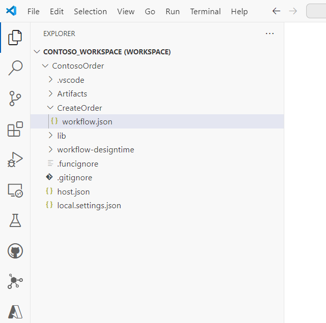

# Lab 1 - Create a Logic App in Visual Studio Code

Azure Logic Apps can be created in two different tiers, *Consumption* and *Standard*. Throughout these tutorials, we will be focussing on Logic Apps Standard, which offers the following benefits over Consumption:

- Local development with Visual Studio Code
- Virtual Network support (VNET)
- Private endpoint
- Application Insights
- Flexible scaling
- Flexible hosting
- Separation of infrastructure and business logic
- More than one workflow per Logic App

For more details, please see [this link](https://learn.microsoft.com/en-us/azure/logic-apps/single-tenant-overview-compare)

We will be using Visual Studio Code throughout the Labs.

# Pre-requisites

Ensure the following Visual Studio Code extensions are installed (note: install the Logic Apps (Standard) extension before Azure Functions as it will download dependencies automatically):

- Azure Resources
- Azure CLI Tools
- Azurite
- C#
- C# Dev Kit
- REST Client
- Azure Logic Apps (Standard)
- Azure Functions

For example, to install the REST Client extension, navigate to *Extensions* on the side bar as highlighed below, then search for *Rest Client* and install it:

[This link](https://learn.microsoft.com/en-us/azure/logic-apps/create-standard-workflows-visual-studio-code#tools) provides an excellent walkthrough to get setup with Visual Studio Code, starting with the Azure Logic Apps Extension for Visual Studio Code. Once installed, the extension will download the pre-requisites required. Review the [pre-requisites](https://learn.microsoft.com/en-us/azure/logic-apps/create-standard-workflows-visual-studio-code#prerequisites) and [tools](https://learn.microsoft.com/en-us/azure/logic-apps/create-standard-workflows-visual-studio-code#tools) for an understanding of the local environment.

## Create a Logic App Standard Workspace and Project using Visual Studio Code

For the labs, we recommend creating a folder structure such as C:\Dev\Labs

Logic Apps projects require a Visual Studio Code *Workspace* to be created first. Follow the instructions [here](https://learn.microsoft.com/en-us/azure/logic-apps/create-standard-workflows-visual-studio-code#create-a-local-workspace) to create a workspace - call it *Contoso_Workspace*. Once the workspace is created, follow the prompts to create a Logic App Project and associated Workflow. Name the project *Contoso_Order* and the Workflow *CreateOrder*.

Once the Workflow is created, an option is displayed to *Enable Connectors in Azure*. Select *Skip for now* (we will cover Azure connectors in a future Lab).

The workspace, project and workflow should look as follows:

Validate the workflow can be loaded by the visual designer by right clicking *workflow.json* and selecting *Open Designer*. The Logic Apps Visual Designer should be displayed:

In the next Lab we will create a trigger and run the Logic App locally.