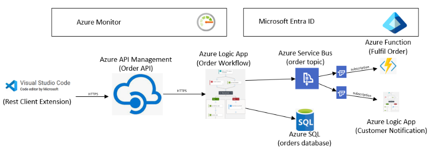

# Azure Integration – Training Focus Areas

Over the course of 6 x 0.5 days, build a fictitious business process for processing customer orders. The actual plan can be flexible, but as a starting point:

We will be building a solution based on the following architecture:

## Sessions (each 0.5 day)
- Logic Apps
- Functions
- Logic Apps and Service Bus
- API Management
- Monitoring
- Deployment

## Areas Covered

### Logic Apps Standard
- Visual Studio Code development
- Setup local environment
- Create Workflows with connectors and conditional logic
- Understand and create error handlers
- Test Workflows, view run history
- Configure application settings
- Deploy from VS Code to Azure Dev environment

### Connectors
- Write to Azure Service Bus Topic
- Subscribe to Azure Service Bus Topic
- Call HTTP REST API
- Call SQL Database
- Hosting – create and understand Logic Apps Standard Plan, settings and scaling
- Monitoring - Application Insights configuration, log custom fields using tracked properties

### Azure Portal
- Create Logic App and Plan
- Create workflows
- Test Workflows, view run history

### Functions
- Visual Studio Code – develop, test and debug locally
- Bindings – input and output e.g., create an input binding to trigger from a Service Bus topic
- Monitoring - Application Insights configuration, log custom data
- Hosting – created and understand Functions Premium Plan, settings and scaling

### Common to Logic Apps and Functions
- Security – use Managed Identity for connecting to Azure resources such as Service Bus
- Security – use KeyVault for managing secrets, use KeyVault References
- Deployment – how to deploy using Azure DevOps
- Networking – create private endpoint, VNET for connecting to private resources such as Service Bus
- Monitoring – understand Application Insights and how to navigate end to end integration

### Service Bus
- Configure Topics and subscriptions
- Configure RBAC security at namespace and queue/topic levels
- Private Networking
- Deployment – how to deploy using Azure DevOps

### API Management
- Create an API
- Create Open API Definition
- Create backend call to Logic App
- Configure monitoring with Application Insights
- Configure security, for example OAUTH
- Test the API including debugging
- Create a Product
- Assign an API to the Product
- Configure security for Developer Portal to access the product

### Deployment
- Create a pipeline in Azure DevOps to deploy the API and Product